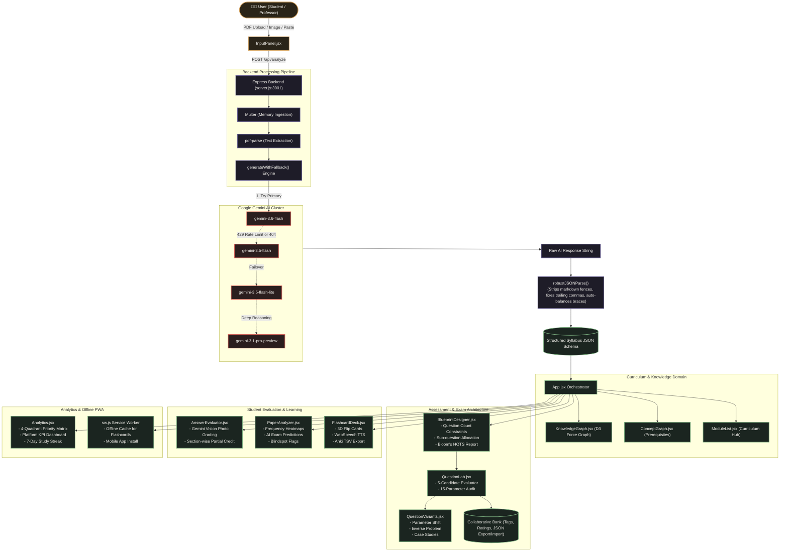
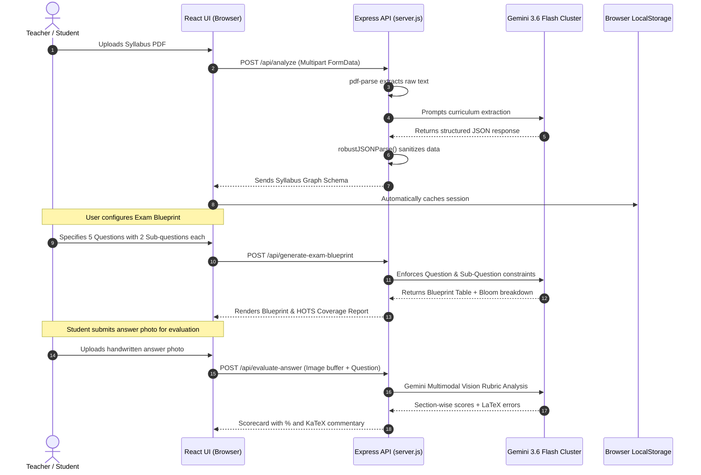

# 🎓 SyllabiMind — System Architecture & Flowcharts

> Comprehensive Architectural Specification, Component Hierarchy, Multi-Model Failover Chains, and End-to-End Data Flowcharts.

---

## 1. Master System Architecture Flowchart

---

## 2. Assessment Lifecycle & Data Flow Sequence

---

## 3. Subsystem Breakdown

| Subsystem | File / Component | Key Responsibility |
|---|---|---|
| **Client Orchestration** | [`App.jsx`](client/src/App.jsx) | Tab navigation, localStorage synchronization, history session drawer. |
| **Document Ingestion** | [`InputPanel.jsx`](client/src/components/InputPanel.jsx) | Handles PDFs, raw text, and pasted screenshots. |
| **Knowledge Visualizer** | [`KnowledgeGraph.jsx`](client/src/components/KnowledgeGraph.jsx) | D3 force-directed knowledge map with topic inspectors. |
| **Concept Graph** | [`ConceptGraph.jsx`](client/src/components/ConceptGraph.jsx) | Visualizes prerequisite flows between foundation and advanced topics. |
| **Exam Blueprint Designer** | [`BlueprintDesigner.jsx`](client/src/components/BlueprintDesigner.jsx) | Generates exam blueprints, enforces sub-questions, and analyzes Bloom's cognitive levels. |
| **AI Question Lab** | [`QuestionLab.jsx`](client/src/components/QuestionLab.jsx) | 5-candidate ranking, 15-parameter rubric reviewer, and collaborative question bank. |
| **Question Variants** | [`QuestionVariants.jsx`](client/src/components/QuestionVariants.jsx) | Generates 4 exam set variations (Parameter shift, Inverse problem, Real-world case). |
| **AI Answer Evaluator** | [`AnswerEvaluator.jsx`](client/src/components/AnswerEvaluator.jsx) | Multimodal answer script grading with partial credit and KaTeX feedback. |
| **Past Paper Analyzer** | [`PaperAnalyzer.jsx`](client/src/components/PaperAnalyzer.jsx) | Maps historical exam questions, computes recurrence heatmaps, and forecasts trends. |
| **Flashcard Deck** | [`FlashcardDeck.jsx`](client/src/components/FlashcardDeck.jsx) | 3D flip active-recall cards, Web Speech TTS, and Anki TSV export. |
| **Platform Analytics** | [`Analytics.jsx`](client/src/components/Analytics.jsx) | Strategic complexity matrix, platform KPI counters, and 7-day study streak. |
| **LaTeX Math Engine** | [`MathText.jsx`](client/src/components/MathText.jsx) | Real-time KaTeX tokenizer rendering formulas in `$inline$` and `$$display$$`. |
| **Backend API** | [`server.js`](server.js) | Express server bound to `0.0.0.0`, multi-model fallback chain, and self-healing parser. |
| **Progressive Web App** | [`manifest.json`](client/public/manifest.json) & [`sw.js`](client/public/sw.js) | Offline asset caching and standalone mobile install. |
